# 🎯 Employee Project Alignment Engine

A comprehensive NLP-powered system for intelligent employee-project matching based on skills, experience, and business requirements.


## 📊 System Overview


## 🎯 Matching Process Flow

```mermaid
flowchart LR
    A[📝 Employee Profile] --> B{Pre-trained Models?}
    B -->|Yes| C[🔄 Use Existing Models]
    B -->|No| D[🛠️ Extract Features]
    
    C --> E[🧮 Binary Vectorization]
    D --> E
    
    E --> F[📊 TF-IDF Analysis]
    F --> G[🔍 Similarity Computation]
    G --> H[⚖️ Hybrid Scoring]
    H --> I[📋 Business Rules]
    I --> J[🎯 Top Recommendations]
    
    J --> K[📱 Display Results]
    J --> L[📄 Export Options]
    
    style A fill:#e3f2fd
    style J fill:#e8f5e8
    style K fill:#fff8e1
    style L fill:#fff8e1
```

## 🌟 Features

- **Advanced NLP Processing**: Uses TF-IDF and binary vectorization for skill matching
- **Hybrid Similarity Engine**: Combines multiple similarity metrics for accurate recommendations
- **Business Rules Engine**: Configurable filters for experience, department, location, and similarity thresholds
- **Interactive Web Interface**: Rich Streamlit dashboard with visualizations and search capabilities
- **HR Real-time Matching**: Instant project recommendations for new employee profiles
- **Modular Architecture**: Clean, maintainable codebase with separate modules for each functionality
- **Comprehensive Analytics**: Detailed reports and visualizations for decision-making
- **Export Capabilities**: Multiple export formats for recommendations and analysis

## 🏗️ Architecture

### System Architecture Diagram

```mermaid
graph TB
    subgraph "🌐 Web Interface Layer"
        ST[Streamlit App]
        HR[HR Matcher]
        DASH[Analytics Dashboard]
        SEARCH[Search & Explore]
    end
    
    subgraph "🧠 Core Processing Layer"
        DP[Data Preprocessing]
        FE[Feature Extraction]
        ME[Matching Engine]
        BR[Business Rules]
    end
    
    subgraph "💾 Data Layer"
        RAW[Raw Data]
        PROC[Processed Data]
        MODEL[Trained Models]
        OUTPUT[Results & Reports]
    end
    
    ST --> DP
    HR --> FE
    DASH --> OUTPUT
    SEARCH --> MODEL
    
    DP --> FE
    FE --> ME
    ME --> BR
    BR --> OUTPUT
    
    RAW --> DP
    DP --> PROC
    FE --> MODEL
    ME --> OUTPUT
    
    style ST fill:#1976d2,color:#fff
    style HR fill:#388e3c,color:#fff
    style DP fill:#f57c00,color:#fff
    style FE fill:#7b1fa2,color:#fff
    style ME fill:#c62828,color:#fff
```

### Directory Structure

```
employee_project_allignment_engine_nlp/
├── 📁 src/                          # Core modules
│   ├── __init__.py                  # Package initialization
│   ├── data_preprocessing.py        # Data cleaning and preprocessing
│   ├── feature_extraction.py        # NLP feature extraction
│   ├── matching_engine.py           # Similarity computation and matching
│   └── utils.py                     # Utilities and configuration
├── 📁 streamlit_app/               # Web interface
│   ├── app.py                      # Main Streamlit application
│   └── requirements.txt            # Streamlit dependencies
├── 📁 data/                        # Data directories
│   ├── raw/                        # Original data files
│   ├── processed/                  # Cleaned data files
│   └── outputs/                    # Generated recommendations
├── 📁 model/                       # Trained models and matrices
├── 📁 notebooks/                   # Jupyter notebooks for development
├── 📁 reports/                     # Generated reports and visualizations
├── main.py                         # Main pipeline script
├── requirements.txt                # Python dependencies
└── README.md                       # This file
```

## 🚀 Quick Start

### Prerequisites

- Python 3.8 or higher
- pip package manager

### Installation

1. **Clone the repository**
   ```bash
   git clone https://github.com/SurajKhodade15/employee_project_allignment_engine_nlp.git
   cd employee_project_allignment_engine_nlp
   ```

2. **Install dependencies**
   ```bash
   pip install -r requirements.txt
   ```

3. **Prepare your data**
   
   Place your CSV files in the `data/raw/` directory:
   - `employee_master.csv` - Employee basic information
   - `employee_experience.csv` - Employee skills and experience
   - `client_projects.csv` - Project requirements and details

### Running the Application

#### Option 1: Web Interface (Recommended)

Launch the Streamlit web application:

```bash
cd streamlit_app
streamlit run app.py
```

The application will open in your browser at `http://localhost:8501`

#### Quick HR Matching Example

1. **Navigate to HR Matcher**: Click "👔 HR Employee-Project Matcher" in the sidebar
2. **Fill Employee Details**:
   - Department: "Data Science" 
   - Years of Experience: 4.5
   - Location: "Mumbai"
   - Experience: "Python programming, Machine Learning, TensorFlow, scikit-learn..."
3. **Get Results**: Click "🚀 Find Matching Projects"
4. **Review Matches**: See projects ranked by similarity with explanations

#### Option 2: Command Line Pipeline

Run the complete pipeline programmatically:

```bash
python main.py
```

## 📊 Data Format

### Employee Master (`employee_master.csv`)
```csv
Employee_ID,Department,Location
EMP001,Data Science,Mumbai
EMP002,AI Research,Bangalore
```

### Employee Experience (`employee_experience.csv`)
```csv
Employee_ID,Skills,Years_Experience
EMP001,"Python, Machine Learning, SQL",5.2
EMP002,"Deep Learning, Python, TensorFlow",3.8
```

### Client Projects (`client_projects.csv`)
```csv
Project_ID,Client_Name,Location,Status,Required_Skills
P301,TechCorp,Mumbai,Active,"Python, Data Analysis"
P302,DataInc,Bangalore,Active,"Machine Learning, AI"
```

## 👔 HR Employee-Project Matcher

The HR Employee-Project Matcher is a powerful new feature that allows HR professionals to instantly find suitable projects for new employees or candidates without needing to add them to the system first.

### 🔄 HR Workflow Diagram

```mermaid
sequenceDiagram
    participant HR as 👔 HR Professional
    participant UI as 🖥️ Streamlit Interface
    participant Engine as 🧠 Matching Engine
    participant Models as 🤖 AI Models
    participant DB as 💾 Project Database
    
    HR->>UI: Input Employee Details
    UI->>Engine: Process Profile
    Engine->>Models: Extract Features
    Models->>Engine: Return Feature Vectors
    Engine->>DB: Query Available Projects
    DB->>Engine: Return Project Data
    Engine->>Models: Compute Similarities
    Models->>Engine: Return Match Scores
    Engine->>UI: Ranked Recommendations
    UI->>HR: Display Results & Explanations
    HR->>UI: Export Reports
    UI->>HR: Download CSV/PDF
```

### 🎯 Key Features

- **Real-time Profiling**: Input employee details on-the-fly
- **Instant Recommendations**: Get project matches immediately
- **Comprehensive Input**: Department, experience, location, skills, and preferences
- **Smart Matching**: AI-powered recommendations with explanations
- **Export Options**: Download results as CSV or detailed reports

### 📋 How to Use

1. **Navigate to HR Matcher**: Select "👔 HR Employee-Project Matcher" from the sidebar
2. **Fill Employee Details**: 
   - Basic info: Department, Years of Experience, Location
   - Experience Description: Detailed skills and technology experience
   - Preferences: Project types and client preferences
3. **Get Recommendations**: Click "🚀 Find Matching Projects"
4. **Review Results**: See matching projects with similarity scores and explanations
5. **Export**: Download recommendations for further action

### 💡 Best Practices

- **Detailed Descriptions**: Provide comprehensive experience descriptions
- **Specific Technologies**: Mention exact tools, frameworks, and technologies
- **Project Context**: Include types of projects worked on
- **Domain Experience**: Specify industry or domain expertise

### 🚀 Quick Demo

1. Open the Streamlit app at `http://localhost:8501`
2. Navigate to "👔 HR Employee-Project Matcher"
3. Fill in sample employee details
4. Click "🚀 Find Matching Projects"
5. Review the recommendations and explanations

## 🎯 How It Works

### 📊 Feature Engineering Process

```mermaid
graph LR
    subgraph "📝 Raw Data"
        A[Employee Skills Text]
        B[Project Requirements]
        C[Experience Data]
    end
    
    subgraph "🔧 Feature Extraction"
        D[Text Preprocessing]
        E[Binary Vectorization]
        F[TF-IDF Analysis]
        G[Numerical Features]
    end
    
    subgraph "🧮 Feature Matrices"
        H[Binary Matrix<br/>Exact Matches]
        I[TF-IDF Matrix<br/>Semantic Similarity]
        J[Combined Features<br/>Hybrid Approach]
    end
    
    A --> D
    B --> D
    C --> D
    
    D --> E
    D --> F
    D --> G
    
    E --> H
    F --> I
    G --> J
    
    H --> K[🎯 Similarity<br/>Computation]
    I --> K
    J --> K
    
    style H fill:#e8f5e8
    style I fill:#e3f2fd
    style J fill:#fff3e0
    style K fill:#fce4ec
```

### 🔍 Similarity Computation Pipeline


### 1. Data Preprocessing
- Cleans and standardizes employee and project data
- Handles missing values and data quality issues
- Creates enhanced datasets with derived features

### 2. Feature Extraction
- **Binary Features**: Exact skill matching using binary vectors
- **TF-IDF Features**: Semantic similarity using term frequency analysis
- **Basic Features**: Numerical features like experience, location encoding

### 3. Similarity Computation
- **Cosine Similarity**: Primary metric for comparing feature vectors
- **Hybrid Scoring**: Weighted combination of binary and TF-IDF similarities
- **Business Rules**: Filters based on experience, department, location

### 4. Recommendation Generation
- Generates top-N recommendations for each project
- Applies configurable business rules and filters
- Enhances results with metadata and quality indicators

## 🎨 Web Interface Features

### 🖥️ Application Interface Overview

```mermaid
graph TB
    subgraph "🏠 Main Dashboard"
        A[System Overview]
        B[Metrics & KPIs]
        C[Data Visualizations]
    end
    
    subgraph "⚙️ Pipeline Management"
        D[Run Complete Pipeline]
        E[Progress Tracking]
        F[Error Handling]
    end
    
    subgraph "📊 Analytics Hub"
        G[Recommendation Analysis]
        H[Interactive Charts]
        I[Export Options]
    end
    
    subgraph "🔍 Search & Explore"
        J[Project → Employee Search]
        K[Employee → Project Search]
        L[Detailed Breakdowns]
    end
    
    subgraph "👔 HR Matcher"
        M[Real-time Input Form]
        N[Instant Recommendations]
        O[Match Explanations]
        P[Report Generation]
    end
    
    style A fill:#e8f5e8
    style D fill:#e3f2fd
    style G fill:#fff3e0
    style J fill:#f3e5f5
    style M fill:#fce4ec
```

### 📱 User Experience Flow


### 🏠 Home & Overview
- System metrics and KPIs
- Data distribution visualizations
- Employee and project statistics

### ⚙️ Run Matching Pipeline
- One-click pipeline execution
- Progress tracking and status updates
- Error handling and feedback

### 📊 View Recommendations
- Comprehensive analytics dashboard
- Interactive charts and visualizations
- Download options for results

### 🔍 Search & Explore
- Project-to-employee search
- Employee-to-project search
- Detailed recommendation breakdowns

### 👔 HR Employee-Project Matcher *(NEW)*
- **Real-time employee profiling**: Input employee details on-the-fly
- **Instant project matching**: Get suitable project recommendations immediately
- **Comprehensive input form**: Department, experience, location, skills, and preferences
- **Smart recommendations**: AI-powered matching with detailed explanations
- **Export capabilities**: Download recommendations as CSV or detailed reports
- **Match reasoning**: Understand why specific projects are recommended

## ⚙️ Configuration

The system uses a centralized configuration class in `src/utils.py`:

```python
# Key configuration parameters
MIN_EXPERIENCE_YEARS = 3.0          # Minimum experience filter
MIN_SIMILARITY_THRESHOLD = 0.05     # Minimum similarity score
TOP_N_RECOMMENDATIONS = 5           # Number of recommendations per project
BINARY_WEIGHT = 0.7                 # Weight for binary similarity
TFIDF_WEIGHT = 0.3                  # Weight for TF-IDF similarity
```

## 📈 Business Rules

### 🔄 Business Logic Flow

```mermaid
flowchart TD
    A[Employee Profile] --> B{Experience Check}
    B -->|≥ Min Years| C{Department Filter}
    B -->|< Min Years| X[❌ Filtered Out]
    
    C -->|Match Found| D{Location Check}
    C -->|No Match| Y[⚠️ Department Mismatch]
    
    D -->|Same/Remote| E{Similarity Score}
    D -->|Different| Z[📍 Location Note]
    
    E -->|≥ Threshold| F[✅ Qualified Match]
    E -->|< Threshold| W[📊 Low Score]
    
    F --> G[🎯 Final Recommendation]
    Y --> G
    Z --> G
    W --> G
    
    style F fill:#c8e6c9
    style G fill:#bbdefb
    style X fill:#ffcdd2
    style Y fill:#fff3e0
    style Z fill:#fff3e0
    style W fill:#fff3e0
```

### ⚖️ Scoring Matrix

```mermaid
graph LR
    subgraph "📊 Similarity Components"
        A[Binary Match<br/>30%] 
        B[TF-IDF Semantic<br/>70%]
    end
    
    subgraph "🎯 Business Multipliers"
        C[Experience Bonus<br/>+10% if Senior]
        D[Location Bonus<br/>+5% if Same]
        E[Department Bonus<br/>+15% if Exact]
    end
    
    subgraph "📋 Final Score"
        F[Composite Score<br/>0.0 - 1.0]
    end
    
    A --> F
    B --> F
    C --> F
    D --> F
    E --> F
    
    style A fill:#e8f5e8
    style B fill:#e3f2fd
    style C fill:#fff3e0
    style D fill:#f3e5f5
    style E fill:#fce4ec
    style F fill:#c8e6c9
```

### Experience Filters
- Minimum years of experience requirement
- Experience level categorization (Junior, Mid-Level, Senior, Expert)

### Department Filters
- Preferred departments for specific projects
- Department exclusion rules

### Location Filters
- Same location preference
- Remote work considerations

### Similarity Thresholds
- Minimum similarity score requirements
- Quality-based filtering

## 🔧 Advanced Usage

### Custom Business Rules

```python
from src.matching_engine import EmployeeProjectMatcher

# Initialize matcher
matcher = EmployeeProjectMatcher(df_employees)

# Add custom filters
matcher.add_experience_filter(min_years=5.0, max_years=15.0)
matcher.add_department_filter(preferred_departments=['Data Science', 'AI Research'])
matcher.add_location_filter(excluded_locations=['Remote'])
matcher.add_similarity_threshold_filter(min_similarity=0.1)
```

### Batch Processing

```python
from main import run_complete_pipeline

# Run complete pipeline
results = run_complete_pipeline()

# Access results
recommendations = results['recommendations']
similarity_matrices = results['similarity_matrices']
report = results['report']
```

## 📊 Output Files

The system generates several output files:

- `final_recommendations.csv` - Complete recommendations with metadata
- `top_candidates_per_project.csv` - Top candidate for each project
- `project_summary.csv` - Aggregated project statistics
- `executive_summary_report.md` - Executive summary report

## 🧪 Testing and Validation

### Data Quality Checks
- Missing value handling
- Data type validation
- Consistency checks

### Model Validation
- Similarity score distributions
- Recommendation quality metrics
- Business rule compliance

### Performance Metrics
- Processing speed
- Memory usage
- Scalability testing

## 🚀 Performance Optimization

### 📊 Performance Metrics Dashboard

```mermaid
graph TB
    subgraph "⚡ Processing Speed"
        A[Data Loading<br/>~2-5 seconds]
        B[Feature Extraction<br/>~10-30 seconds]
        C[Similarity Computation<br/>~5-15 seconds]
        D[Results Generation<br/>~1-3 seconds]
    end
    
    subgraph "💾 Memory Usage"
        E[Small Dataset<br/>< 1GB RAM]
        F[Medium Dataset<br/>1-4GB RAM]
        G[Large Dataset<br/>4-16GB RAM]
    end
    
    subgraph "📈 Scalability"
        H[100 Employees<br/>100 Projects]
        I[1K Employees<br/>500 Projects]
        J[10K Employees<br/>1K Projects]
    end
    
    A --> E
    B --> F
    C --> G
    D --> H
    
    style A fill:#e8f5e8
    style B fill:#fff3e0
    style C fill:#e3f2fd
    style D fill:#c8e6c9
```

### 🔄 Optimization Strategies

```mermaid
flowchart LR
    A[Raw Data] --> B{Size Check}
    
    B -->|Small| C[Direct Processing]
    B -->|Large| D[Batch Processing]
    
    C --> E[In-Memory Operations]
    D --> F[Chunked Processing]
    
    E --> G[Fast Results]
    F --> H[Memory Efficient]
    
    G --> I[Cache Results]
    H --> I
    
    I --> J[🚀 Optimized Performance]
    
    style C fill:#c8e6c9
    style D fill:#bbdefb
    style I fill:#fff9c4
    style J fill:#fce4ec
```

### For Large Datasets
- Batch processing capabilities
- Memory-efficient data handling
- Parallel processing options

### Caching
- Feature matrix caching
- Model persistence
- Result caching

## 🤝 Contributing

1. Fork the repository
2. Create a feature branch (`git checkout -b feature/AmazingFeature`)
3. Commit your changes (`git commit -m 'Add some AmazingFeature'`)
4. Push to the branch (`git push origin feature/AmazingFeature`)
5. Open a Pull Request

## 📋 TODO

- [ ] Add support for project priority weighting
- [ ] Implement real-time recommendation updates
- [ ] Add email notification system
- [ ] Create mobile-responsive UI
- [ ] Add multi-language support
- [ ] Implement user authentication
- [ ] Add API endpoints for integration

## 🐛 Troubleshooting

### 🔧 Common Issues Resolution Flow

```mermaid
flowchart TD
    A[❌ Issue Detected] --> B{Issue Type?}
    
    B -->|Data Loading| C[📁 Data Issues]
    B -->|Memory| D[💾 Memory Issues] 
    B -->|Streamlit| E[🌐 App Issues]
    
    C --> C1[Check file paths]
    C --> C2[Verify CSV format]
    C --> C3[Check encoding UTF-8]
    
    D --> D1[Reduce batch size]
    D --> D2[Use data sampling]
    D --> D3[Upgrade RAM]
    
    E --> E1[Check port 8501]
    E --> E2[Verify dependencies]
    E --> E3[Check Python path]
    
    C1 --> F[✅ Resolution]
    C2 --> F
    C3 --> F
    D1 --> F
    D2 --> F
    D3 --> F
    E1 --> F
    E2 --> F
    E3 --> F
    
    style C fill:#ffcdd2
    style D fill:#fff3e0
    style E fill:#e3f2fd
    style F fill:#c8e6c9
```

### 📊 System Health Dashboard

```mermaid
graph LR
    subgraph "🔍 Diagnostics"
        A[Data Quality<br/>✅ Good]
        B[Model Performance<br/>⚠️ Check]
        C[Memory Usage<br/>✅ Normal]
        D[Response Time<br/>✅ Fast]
    end
    
    subgraph "📈 Metrics"
        E[Accuracy: 92%]
        F[Coverage: 98%]
        G[Speed: < 30s]
        H[Uptime: 99.9%]
    end
    
    A --> E
    B --> F
    C --> G
    D --> H
    
    style A fill:#c8e6c9
    style B fill:#fff3e0
    style C fill:#c8e6c9
    style D fill:#c8e6c9
```

### Common Issues

1. **Data Loading Errors**
   - Check file paths and CSV format
   - Ensure all required columns are present
   - Verify data encoding (UTF-8 recommended)

2. **Memory Issues with Large Datasets**
   - Reduce batch size in configuration
   - Use data sampling for testing
   - Consider upgrading system RAM

3. **Streamlit App Not Loading**
   - Check port availability (8501)
   - Verify all dependencies are installed
   - Check Python path configuration

### Getting Help

- Check the [Issues](https://github.com/SurajKhodade15/employee_project_allignment_engine_nlp/issues) page
- Create a new issue with detailed problem description
- Include system information and error logs

## � Project Statistics

### 🎯 Matching Accuracy Metrics


### 📈 System Usage Analytics


### 🏆 Feature Adoption Rate

```mermaid
graph LR
    A[👔 HR Matcher<br/>85% Usage] 
    B[📊 Analytics<br/>78% Usage]
    C[🔍 Search<br/>65% Usage]
    D[⚙️ Pipeline<br/>45% Usage]
    
    style A fill:#4caf50,color:#fff
    style B fill:#2196f3,color:#fff
    style C fill:#ff9800,color:#fff
    style D fill:#9c27b0,color:#fff
```

## �📝 License

This project is licensed under the MIT License - see the [LICENSE](LICENSE) file for details.

## 👥 Authors

- **Suraj Khodade** - *Initial work* - [SurajKhodade15](https://github.com/SurajKhodade15)

## 🙏 Acknowledgments

- Streamlit team for the amazing web framework
- scikit-learn contributors for ML tools
- Plotly team for interactive visualizations
- Open source community for inspiration and tools

## 📞 Contact

- **Email**: suraj.khodade7@gmail.com
- **LinkedIn**: [Suraj Khodade](https://linkedin.com/in/surajkhodade)
- **GitHub**: [SurajKhodade15](https://github.com/SurajKhodade15)

---

<div align="center">
  <strong>⭐ Star this repository if you find it helpful! ⭐</strong>
</div>
